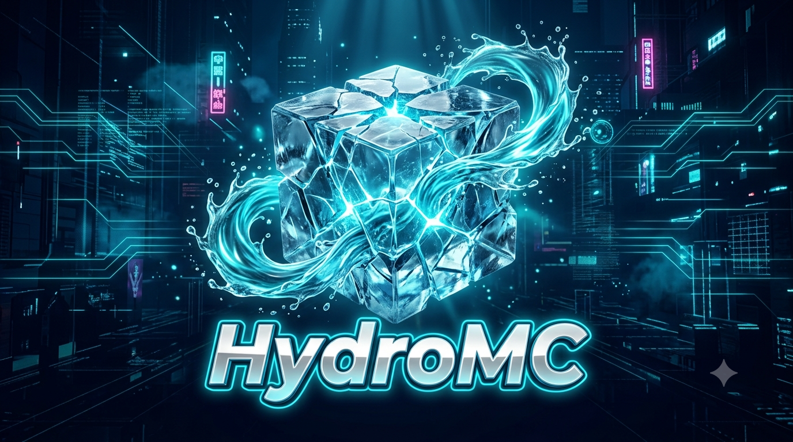

HydroMC | Survival Multiplayer Chill

**IP**: ``Hydromc.online``

**Sites**: [Hydromc.free.je/](https://hydromc.free.je/)

**Dsc**: [Discord.gg/3qJC85Gwma](https://discord.gg/3qJC85Gwma)

## Mô tả
Repo này được tạo ra để hướng dẫn các thành viên của máy chủ [HydroMC](https://discord.gg/3qJC85Gwma) cách chơi máy chủ hiệu quả. Nếu bạn là một người mới, xin hãy đọc hết trang này để hiểu rõ hơn về máy chủ.
## Lối chơi
*Sinh tồn - Khám phá - Xây dựng*
| Tóm tắt lối chơi của server
- Sinh tồn: Sinh tồn trên một thế giới mở, tự do khám phá mà không bị ảnh hưởng gì.
- Khám phá: Đa dạng các tính năng độ đáo, hấp dẫn đang chờ bạn khám phá. Hệ thống nhiệm vụ và vật phẩm đồ sồ, các tính năng kinh tế hấp dẫn.
- Xây dựng: Đây là một máy chủ thiên về lối chơi chậm rãi, tận hưởng cuộc sống.
| Chi tiết lối chơi
- Có 5 thế giới chính: Spawn (Nơi bạn đến khi vừa vào máy chủ), Over World (Nơi bạn sẽ bắt đầu sinh tồn), Nether (Một thế giới giúp bạn mạnh mẽ hơn), The end (Nơi tràn ngập tài nguyên thú vị) [Tất cả 4 thế giới trên đều không được phép PvP] và Resource (Nơi bạn tự do tìm kiếm tài nguyên, thế giới sẽ tự động làm mới sau 1 tuần) [Thế giới trên sẽ được PvP] {Tất cả thế giới đều được bật *Giữ túi đồ*}
- Các hệ thống kinh tế trong máy chủ: Shop (Shop cố định của máy chủ), Auction (Nhà đấu giá dành riêng cho người chơi), Bank (Ngân hàng dùng để vay hoặc gửi tiền),...
- Các tính năng khác như: Pet, Trade, Crate, Skill, Battle Pass,...
## Lệnh cơ bản
- Tpa System:
  + /tpa <player> (Gửi lời mời tpa đến một người chơi đang online)
  + /tpahere <player> (Gửi yêu cầu tới người chơi và mời họ đến chỗ mình)
  + /tpaccept or /tpdeny (Chấp nhận hoặc từ chối lời mời của người khác)
  + /tpacancel (Thu hồi lời mời tpa hoặc tphere)
- Economy System:
  + /shop (Mở shop bán vật phẩm)
  + /sellgui (Mở giao diện thu mua vật phẩm)
  + /auction (Mở giao diện đấu giá)
  + /bank (Mở ngân hàng)
- Quick CMD:
  + /spawn (Về spawn chính)
  + /warps (Mở GUI khu vực)
  + /homes (Mở GUI quản lí nhà)
  + ...

Đây là tài liệu cơ bản, bạn có thể nhờ trợ giúp từ người chơi khác tại máy chủ [Discord](https://discord.gg/3qJC85Gwma)!
Rất mong nó giúp ích cho bạn!

*Tài liệu này sẽ sớm được cập nhật*
